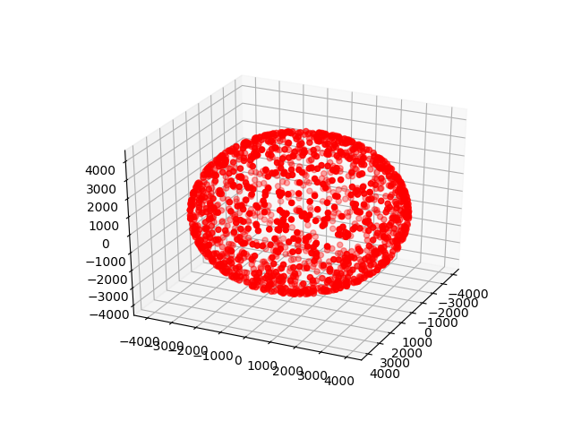
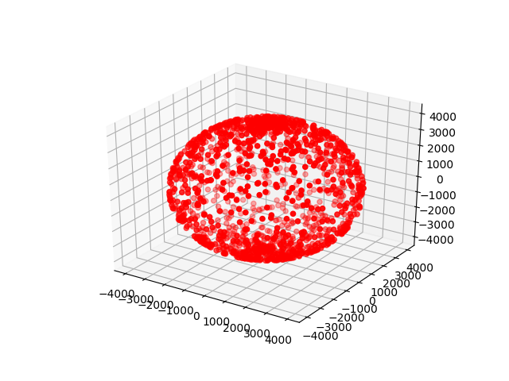

[Explanation on mathworld.wolfram.com](http://mathworld.wolfram.com/SpherePointPicking.html)

points count  1500  
sphere radius 4000

Correctly distributed      |  Incorrectly distributed
:-------------------------:|:-------------------------:
  |  
